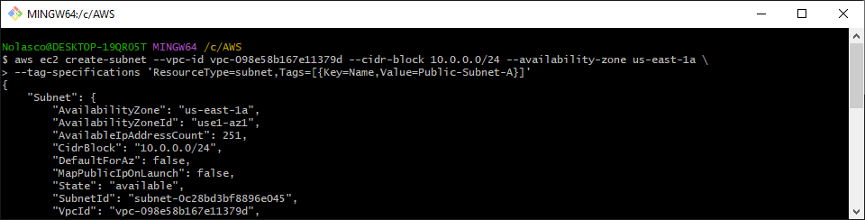
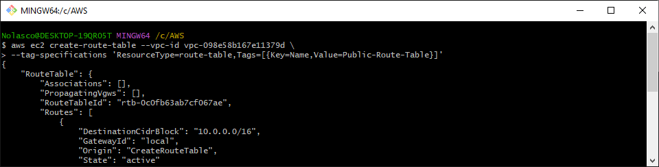
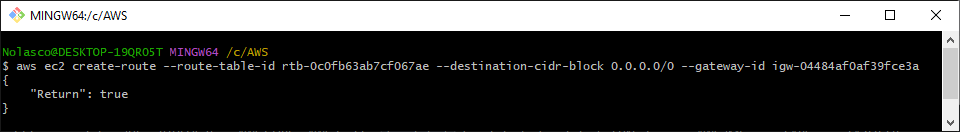
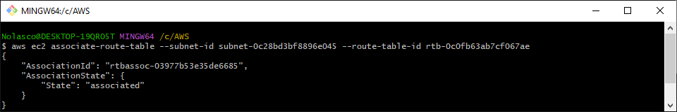
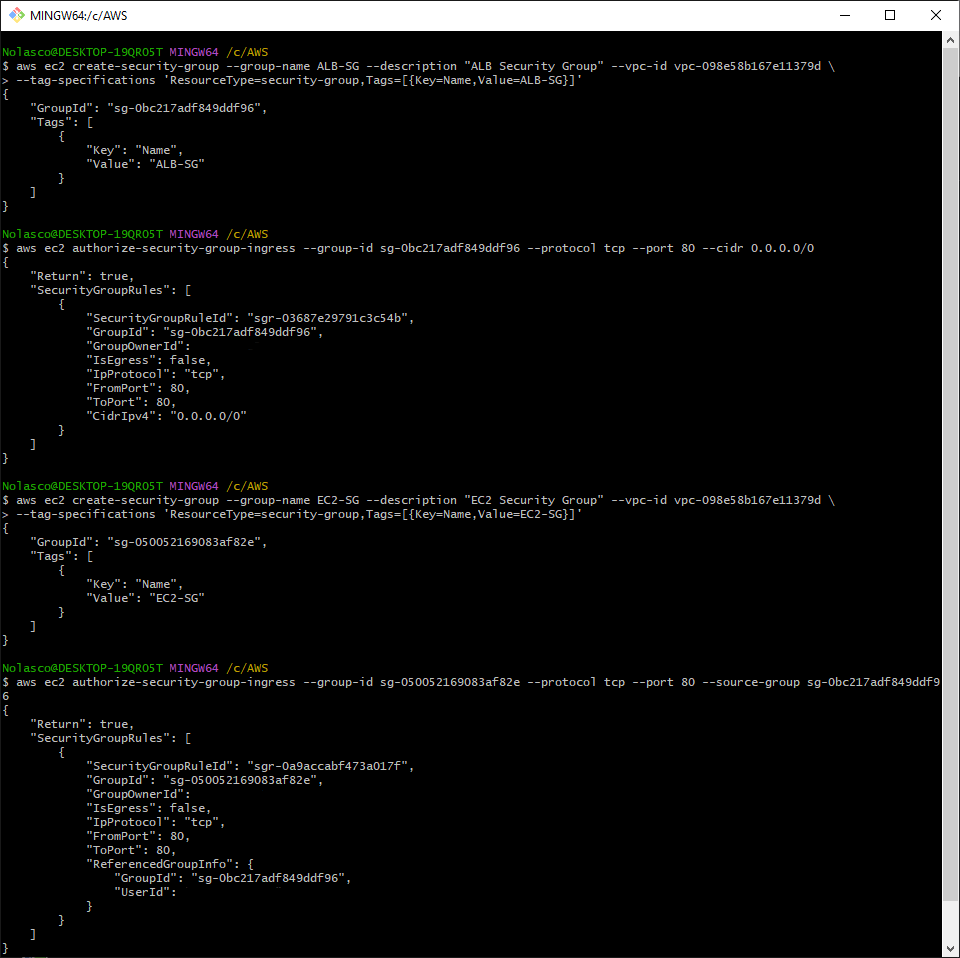

# AWS Application Load Balancer Lab *(IN PROGRESS)*

<div align="center">
  
</div>

## Overview
Use the Elastic Load Balancing (ELB) and Amazon EC2 Auto Scaling to load balance and automatically scale the infrastructure

---
⚠️ **Attention:**
- All the tasks will be completed via the command line using AWS CLI. Ensure you have the necessary permissions. [Install AWS CLI](https://docs.aws.amazon.com/cli/latest/userguide/getting-started-install.html)
- Charges may apply for completing this lab. [AWS Pricing](https://aws.amazon.com/pricing/)
---

## Step 1: Create a VPC:
- VPC:
```bash
aws ec2 create-vpc \
  --cidr-block 10.0.0.0/16 \
  --tag-specifications 'ResourceType=vpc,Tags=[{Key=Name,Value=ALB-Lab-VPC}]'
```

<div align="center">
  
</div>

---

## Step 2: Create Subnets
#### Public Subnets
- Availability Zone 1 - Public Subnet A:
```bash
aws ec2 create-subnet \
  --vpc-id <vpc-id> \
  --cidr-block 10.0.0.0/24 \
  --availability-zone <availability-zone-1> \
  --tag-specifications 'ResourceType=subnet,Tags=[{Key=Name,Value=Public-Subnet-A}]'
```

<div align="center">
  
</div>

- Availability Zone 2 - Public Subnet B:
```bash
aws ec2 create-subnet \
  --vpc-id <vpc-id> \
  --cidr-block 10.0.2.0/24 \
  --availability-zone <availability-zone-2> \
  --tag-specifications 'ResourceType=subnet,Tags=[{Key=Name,Value=Public-Subnet-B}]'
```

<div align="center">
  
</div>

#### Private Subnets
- Availability Zone 1 - Private Subnet A:
```bash
aws ec2 create-subnet \
  --vpc-id <vpc-id> \
  --cidr-block 10.0.1.0/24 \
  --availability-zone <availability-zone-1> \
  --tag-specifications 'ResourceType=subnet,Tags=[{Key=Name,Value=Private-Subnet-A}]'
```

<div align="center">
  
</div>

- Availability Zone 2 - Private Subnet B:
```bash
aws ec2 create-subnet \
  --vpc-id <vpc-id> \
  --cidr-block 10.0.3.0/24 \
  --availability-zone <availability-zone-2> \
  --tag-specifications 'ResourceType=subnet,Tags=[{Key=Name,Value=Private-Subnet-B}]'
```

<div align="center">
  
</div>

---

## Step 3: Create an Internet Gateway
- Internet Gateway
```bash
aws ec2 create-internet-gateway \
  --tag-specifications 'ResourceType=internet-gateway,Tags=[{Key=Name,Value=ALB-Lab-Internet-Gateway}]'
```
- Attach the Internet Gateway to the VPC:
```bash
aws ec2 attach-internet-gateway \
  --vpc-id <vpc-id> \
  --internet-gateway-id <internet-gateway-id>
```

<div align="center">
  
</div>

---

## Step 4: Create a Route Table and Routes for Public Subnets
- Public Route Table
```bash
aws ec2 create-route-table \
  --vpc-id <vpc-id> \
  --tag-specifications 'ResourceType=route-table,Tags=[{Key=Name,Value=Public-Route-Table}]'
```

<div align="center">
  
</div>

- Create a route to the Internet Gateway:
```bash
aws ec2 create-route \
  --route-table-id <route-table-id> \
  --destination-cidr-block 0.0.0.0/0 \
  --gateway-id <internet-gateway-id>
```

<div align="center">
  
</div>

- Associate with Public Subnet A:
```bash
aws ec2 associate-route-table \
  --subnet-id <public-subnetA-id> \
  --route-table-id <route-table-id>
```

<div align="center">
  
</div>

- Associate with Public Subnet B:
```bash
aws ec2 associate-route-table \
  --subnet-id <public-subnetB-id> \
  --route-table-id <route-table-id>
```

<div align="center">
  
</div>

---

## Step 5: Create Security Groups
- Security Group for Application Load Balancer (ALB):
```bash
aws ec2 create-security-group \
  --group-name ALB-SecurityGroup \
  --description "ALB Security Group" \
  --vpc-id <vpc-id> \
  --tag-specifications 'ResourceType=security-group,Tags=[{Key=Name,Value=ALB-SecurityGroup}]'
```
- Add inbound rules for HTTP (port 80):
```bash
aws ec2 authorize-security-group-ingress \
  --group-id <ALB-security-group-id> \
  --protocol tcp --port 80 \
  --cidr 0.0.0.0/0
```
- Security Group for EC2 Instances
```bash
aws ec2 create-security-group \
  --group-name EC2-SecurityGroup \
  --description "EC2 Security Group" \
  --vpc-id <vpc-id> \
  --tag-specifications 'ResourceType=security-group,Tags=[{Key=Name,Value=EC2-SecurityGroup}]'
```
- Allow traffic from the ALB:
```bash
aws ec2 authorize-security-group-ingress \
  --group-id <EC2-security-group-id> \
  --protocol tcp --port 80 \
  --source-group <ALB-security-group-id>
```

<div align="center">
  
</div>

---

## Step 6: Create an Application Load Balancer
- Create the ALB in the public subnets:
```bash
aws elbv2 create-load-balancer \
  --name my-load-balancer \
  --subnets <public-subnetA-id> <public-subnetB-id> \
  --security-groups <ALB-security-group-id> \
  --scheme internet-facing \
  --tags Key=Name,Value=My-ALB
```

---

## Step 7: Create a Target Group for EC2 Instances
```bash
aws elbv2 create-target-group \
  --name my-target-group \
  --protocol HTTP --port 80 \
  --vpc-id <vpc-id> \
  --tags Key=Name,Value=My-Target-Group
```

---

## Step 8: Create a Listener for the Load Balancer
```bash
aws elbv2 create-listener \
  --load-balancer-arn <load-balancer-arn> \
  --protocol HTTP \
  --port 80 \
  --default-actions Type=forward,TargetGroupArn=<target-group-arn>
```

---

## Step 9: Launch EC2 Instances with Auto Scaling
- Create a Launch Template:
```bash
aws ec2 create-launch-template \
  --launch-template-name my-template \
  --version-description v1 \
  --launch-template-data '{
    "ImageId": "<ami-id>",
    "InstanceType": "t2.micro",
    "SecurityGroupIds": ["<EC2-security-group-id>"],
    "KeyName": "<key-name>",
    "UserData": "'$(echo -n "#!/bin/bash
yum -y install httpd
systemctl start httpd
systemctl enable httpd
echo \"<html><h1>Welcome to My Web Server!</h1></html>\" > /var/www/html/index.html")'"
  }' \
  --tag-specifications 'ResourceType=launch-template,Tags=[{Key=Name,Value=My-Launch-Template}]'
```
- Create an Auto Scaling Group:
```bash
aws autoscaling create-auto-scaling-group \
  --auto-scaling-group-name my-auto-scaling-group \
  --launch-template LaunchTemplateName=my-template,Version=1 \
  --min-size 1 \
  --max-size 3 \
  --desired-capacity 2 \
  --vpc-zone-identifier "<private-subnetA-id>,<private-subnetB-id>" \
  --tags Key=Name,Value=My-Auto-Scaling-Group
```
- Attach the Auto Scaling Group to the Target Group:
```bash
aws autoscaling attach-load-balancer-target-groups \
  --auto-scaling-group-name my-auto-scaling-group \
  --target-group-arns <target-group-arn>
```

---

## Step 10: (Optional) Enable Auto Scaling Policies
- You can set policies for scaling in and out based on CPU usage or other metrics:
```bash
aws autoscaling put-scaling-policy \
  --auto-scaling-group-name my-auto-scaling-group \
  --policy-name scale-out \
  --scaling-adjustment 1 \
  --adjustment-type ChangeInCapacity
```
```bash
aws autoscaling put-scaling-policy \
  --auto-scaling-group-name my-auto-scaling-group \
  --policy-name scale-in \
  --scaling-adjustment -1 \
  --adjustment-type ChangeInCapacity
```

---

## Step 11: Test the Setup
- After launching the setup, you can access the Application Load Balancer's DNS name and ensure it's routing traffic to the instances correctly.
```bash
aws elbv2 describe-load-balancers --names my-load-balancer
```
